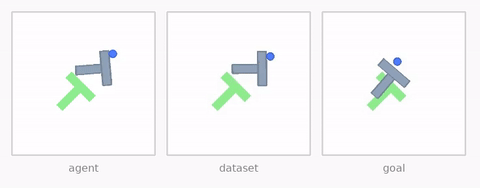
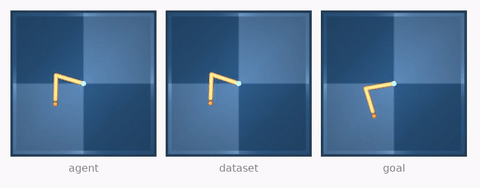
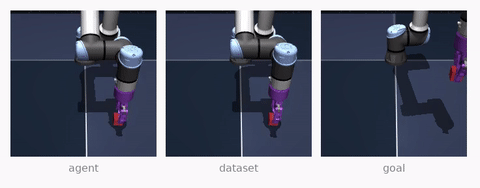

# Hamiltonian JEPA: Action-Conditioned World Models with an Inherited Control State

<p align="center">
  
  
  
</p>

H-JEPA is a reconstruction-free world model that learns to plan from pixels.

* A ViT encoder maps every frame to a perceptual code `h` on a sphere, held near isotropy by a Bures-Wasserstein prior.
* A fixed orthonormal slice `s = Uᵀh` is the control state. It inherits the covariance of `h` and is the only quantity the planner scores.
* A phase-conditioned dissipative port-Hamiltonian predictor advances `s` under actions through an orthonormal input port `G`.
* Port-inverse consistency (PIC) reads the executed action back through `Gᵀ`, which reweights the rollout error toward the directions in which actions act.

Training minimizes `L = L_pred + L_PIC + L_iso` over five-step open-loop rollouts. Planning runs CEM on `‖ŝ_{t+5} − s_goal‖²`.

## Setup

```bash
uv venv
source .venv/bin/activate
uv pip install -r requirements.txt
export STABLEWM_HOME=/path/to/data
```

Download the datasets from the [LeWM collection](https://huggingface.co/collections/quentinll/lewm) and place them as

```
$STABLEWM_HOME/datasets/tworoom.h5
$STABLEWM_HOME/datasets/pusht_expert_train.h5
$STABLEWM_HOME/datasets/dmc/reacher_random.h5
$STABLEWM_HOME/datasets/ogbench/cube_single_expert.h5
```

## Train

```bash
python train.py data=pusht
```

`data` is one of `tworoom`, `reacher`, `pusht`, `cube`. Every task trains for 10 epochs with batch size 128 and seed 3072. The state rank is the only task-specific choice. A checkpoint is written after every epoch to `$STABLEWM_HOME/hjepa/<task>/hjepa_epoch_<n>_object.ckpt`.

| Task | Rank | CEM iterations |
|:-|:-:|:-:|
| Two-Room | 32 | 10 |
| Reacher | 64 | 10 |
| PushT | 192 | 30 |
| OGB-Cube | 32 | 10 |

## Evaluate

```bash
bash scripts/eval.sh pusht
```

This plans on 500 fixed test episodes in ten batches of 50 and prints the success rate. Pass a checkpoint path as a second argument to evaluate another one. To record rollout videos next to the checkpoint

```bash
python eval.py -cn pusht policy=/path/to/hjepa_epoch_10_object.ckpt eval.video=true
```

## Results

Planning success rate (%) over 500 test episodes, mean ± std over three training seeds.

| Method | Two-Room | Reacher | PushT | OGB-Cube |
|:-|:-:|:-:|:-:|:-:|
| PLDM | 93.73 ± 1.03 | 64.33 ± 2.14 | 76.13 ± 1.70 | 57.27 ± 1.53 |
| LeWM | 74.93 ± 0.42 | 79.87 ± 0.90 | 84.53 ± 1.50 | 64.13 ± 1.89 |
| Sub-JEPA | 90.60 ± 0.53 | 81.00 ± 2.40 | 63.73 ± 0.12 | 62.67 ± 1.45 |
| Delta-JEPA | **100.00 ± 0.00** | 81.33 ± 0.50 | 89.07 ± 1.90 | 79.27 ± 1.81 |
| H-JEPA | **100.00 ± 0.00** | **86.13 ± 0.23** | **90.40 ± 0.60** | **91.93 ± 1.30** |

## Acknowledgements

The data pipeline and planning stack build on [LeWorldModel](https://github.com/lucas-maes/le-wm) and [stable-worldmodel](https://github.com/galilai-group/stable-worldmodel).
